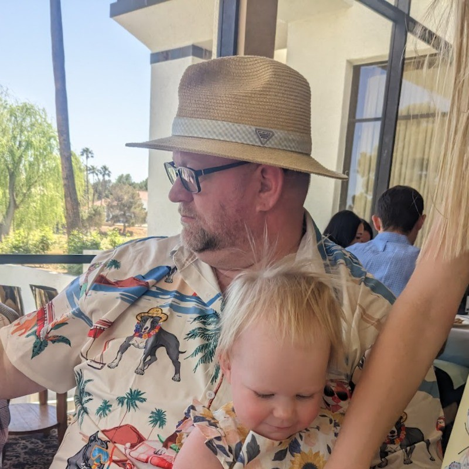

class: center, middle

# Beyond the Prompt

## Lessons from Building with Claude Code

???

Welcome everyone. Today I'm going to tell you a story about how we almost made a catastrophic architectural decision, and how a team of AI subagents caught it before we wrote a single line of code.

This is a true story from the FLUO project - a behavioral assurance platform for OpenTelemetry. The names haven't been changed because I am not innocent.

---

# Who Am I?



**Scott Scoble**

Breaking builds since the 90s

???

Like most of you, I break builds; but I've been doing it since the late 90s.

--

Building Fluo - otel traces to behavioral signals

???

I'm building Fluo with Claude Code; a behavioral assurance platform for OpenTelemetry.

--

Building a write only high performance database (no name yet)

???

For Fluo, I'm cooking up a write-only, high performance database built on top of DuckDB and Parquet with some consensus seasoning on top.

---

class: center, middle


???

Let's dive in.

---

# The Request

"I don't want arbitrary code to run in my JVM."

???

October 2025. We're building FLUO. Users write custom rules using OGNL to match patterns in telemetry traces.

But here's the scary part: their code runs in OUR JVM. They could access our database, call our APIs, exfiltrate data.

--

**Quick question**: How many of you have had user code running in your project?

???

Ask the audience: How many have dealt with this?

note: Sets up the shared pain point.

--

Yeah. That's the problem.

---

# So I Asked Claude Code

"How do we sandbox this?"

--

And that's when I learned something important.

--

**The answer depends on what Claude knows.**

???

This is the bridge. We go from the sandboxing problem to the realization that Claude's answer quality depends on the context it has.

This sets up why context window economics matters - it's not theoretical, it directly affects the quality of solutions you get.

---

class: center, middle

# Part 1: The Problem

## Context Window Economics

???

Now we transition to explaining the constraint. The audience understands WHY we're talking about this - because it affects the sandboxing solution.

This is the foundation that makes everything else possible.

---

# The Context Window Problem

**Question**: How much documentation does your project have?

--

FLUO has 15 ADRs. Plus 10 technical domains. Plus 7 subagent perspectives we need on every decision.

--

**If we loaded everything**: 75,000 tokens

--

Your context window is... gone.

???

Ask the audience to think about their own projects. How many ADRs? How much documentation?

FLUO is complex: Nix, Quarkus, React, custom DSL. And we need input from PM, EM, TL, SecOps, SRE, BA, CS on every feature.

Traditional approach: load all 15 ADRs. That's 75,000 tokens before writing a single line of code.

The AI can't even start. The context window is full of documentation.

note: ask questions from the group on their documentation excess.

---

# Progressive Disclosure: The Solution

**Level 1**: Metadata (~100 tokens per skill)
```yaml
---
name: security-expert
description: OWASP review, compliance controls
---
```

???

The solution is called progressive disclosure, and it's built into Anthropic's Skills system.

Level 1: Just metadata. Name and description. About 100 tokens. This is ALWAYS loaded. It's how Claude knows what expertise is available.

---

# Progressive Disclosure: The Solution

**Level 2**: Instructions (~1,000 tokens when triggered)
```markdown
# When to Use
- Code touches authentication
- External API integration
- User input validation needed
```

???

Level 2: Instructions. The actual "how to" guidance. About 1,000 tokens. Only loads when Claude determines it's relevant to your task.

---

# Progressive Disclosure: The Solution

**Level 3**: Resources (unlimited, on-demand)
```
/skills/security/owasp-checklist.md
/skills/security/threat-models/
```

???

Level 3: Resources. Detailed checklists, threat models, code examples. Unlimited size. Never loaded into context - accessed on-demand via filesystem.

This three-tier system is why we can have 10 skills, 7 subagents, and still use only 1,700 tokens upfront instead of 75,000.

---

# FLUO's Token Budget

**Traditional (ADRs only)**:
```
75,000 tokens loaded upfront
= Context window exhausted
```

???

Here's where we started. We loaded all the ADRs upfront and exhausted our token budget. I was compacting every 3 or 4 requests.

--

**With Skills + Subagents**:
```
10 skills × 100 tokens = 1,000 tokens
7 subagents × 100 tokens = 700 tokens
Total: 1,700 tokens metadata

When 2-3 trigger: +3,000 tokens instructions
Total active: ~5,000 tokens
```

???

With Skills and Subagents: 1,700 tokens for all metadata. When 2-3 trigger based on your task, you add about 3,000 more. Total: 5,000 tokens for full guidance.

--

**Result**: 95% token reduction, 97% faster

???

That's a 95% reduction. And because we're not loading massive documents, execution is 97% faster.

But the real win isn't speed. It's preventing waste.

---

# Quick Check

Count your functional docs × 1,500 tokens

--

If >10K, you need this.

--

Now let me show you **why** this matters.

???

Quick audience check - how big is their documentation? This makes it personal.

If they're over 10K tokens, they have the same problem FLUO had.

Now we go back to the sandboxing story to show how this actually prevented disaster.

---

class: center, middle

# Back to Sandboxing

Remember: user code running in our JVM

???

We're circling back to the opening problem. The audience remembers the setup.

Now they'll see how the context window solution (Skills + Subagents) saved us from making a terrible decision.

---

class: center, middle

# Part 2: The Pattern

## Building a Dream Team

We're assembling subagents and giving them superpowers (skills)

???

Now we name the pattern with a relatable metaphor: building a dream team.

Each subagent is like a team member with their own perspective. Skills are their superpowers - the knowledge and constraints they enforce.

The audience has seen the problem (sandboxing), understands the constraint (context windows), and now they'll see the solution: a team of AI agents working together.

Here's how four different subagents each brought their perspective to the table.

---

# The Implementer Speaks

"Use Java SecurityManager. Two weeks, done."

???

First team member: the implementer. This agent wants to ship fast.

Java SecurityManager. Two-week estimate. Sounds perfect.

--

**Show of hands**: How many would ship this?

???

Ask the audience: would you ship this? Most hands go up. We all want fast solutions.

--

I was ready to.

???

Then reveal: I was ready to. But then another team member spoke up.

Build suspense about what saved us.

---

# Round 2: Architecture Guardian

Then the architecture agent spoke up.

???

The architecture guardian reviews everything against our ADRs. It's relentless.

--

"SecurityManager? **Deprecated in Java 17.**"

???

It caught something I missed: SecurityManager is deprecated. Removed in Java 21.

???

--

Oh no. We're using Java 25.

???

Pause here. Let it sink in. The audience gets it: we would have shipped dead code.

The "fast" solution just became the impossible one.

---

# Round 3: Security Expert

"Even if SecurityManager wasn't deprecated..."

"...it's bypassable with reflection."

???

The security expert is brutal. OWASP compliance is non-negotiable.

SecurityManager has known vulnerabilities. Reflection bypass. No resource limits. A malicious rule could DoS the entire system.

--

"3 out of 10 security rating."

--

**Question**: Would you ship 3/10 security to production?

???

Ask the audience: Would you ship 3/10 security?

The answer is obvious. But here's the thing: I almost did. Because I didn't know.

That's the value of having a security expert review BEFORE writing code.

---

# Round 4: QA Expert

Testing requirements:
- Attack simulations (reflection bypass)
- Performance regression (<10% overhead)
- Multi-tenant isolation
- Resource exhaustion edge cases
- Concurrency stress tests

--

**Adds 1 week for 95%+ coverage**

???

The QA expert is fanatical about quality. It doesn't trust any implementation without comprehensive tests.

It defines what testing looks like: Attack simulations trying to bypass each layer. Performance tests to ensure sandboxing doesn't kill throughput. Multi-tenant isolation tests. Resource exhaustion edge cases. Concurrency stress tests.

The implementation specialist is starting to sweat. The product manager hasn't even weighed in yet.

---

# Round 5: Product Manager

**Product Manager evaluates the trade-off**:

--

**Option A: SecurityManager**
```
Timeline: 2 weeks now + 10 weeks rewrite = 12 weeks total
Security: 3/10
Risk: Complete rewrite needed in 6 months
```

???

Time in AI-speak isn't real; it's relative. Option A looks pretty terrible.

--

**Option B: Capability-based security**
```
Timeline: 6 weeks now + 0 weeks later = 6 weeks total
Security: 10/10
Risk: None (future-proof)
```

???

Half the time and 10/10 security score? Sign me up!

---

# Round 5: Product Manager

**Product Manager evaluates the trade-off**:

> "Ship capability-based security. The 4-week investment now saves 6 weeks later, and we get 10/10 security instead of 3/10."

???

Finally, the product manager looks at this through the lens of total cost and customer value.

The math is obvious. The 4-week delta upfront saves us 6 weeks of rework. Plus we don't ship a security vulnerability.

Decision made. Ship capability-based security.

---

# The Punchline

So after all that evaluation... how long did it take?

---

# 3 Days

--

The subagents made all the hard decisions. Claude Code just implemented them.

???

--

They caught:
- Java 17 deprecation
- Security vulnerabilities
- Testing requirements
- Total cost analysis

???

Then I asked Claude Code to implement capability-based security with 4 layers.

It took 3 days.

Why so fast? Because all the decisions were made. No backtracking. No "oh wait, this won't work." No rework.

The evaluation took 30 minutes. It prevented 12 weeks of waste.

That's a 2,400x return on time invested.

---

# Next Steps

Start with one skill - pick the constraint AI always violates on your project.

Document it. See what changes.

???

Here's your second call to action. Think about your project. What's the one thing AI always gets wrong?

For us, it was suggesting Python dependencies when we wanted pure Nix. For you, it might be "never use eval()", "always validate user input", "follow our naming conventions".

Whatever it is, create a skill for it today. Just one. Put it in a `.skills/` directory. Add YAML frontmatter with a clear description.

Then ask Claude to work on something that would normally violate it. Watch what happens. Claude will follow the skill automatically.

One skill. See how it works. Then expand.

Now let me show you how this pattern prevents waste at scale.

---

class: center, middle

# Part 3: The Outcome

## Preventing Waste at Scale

???

The sandboxing decision saved us 12 weeks. But that's just one feature.

Let me show you what happens when you apply this pattern to an entire project. This is where it gets really powerful.

---

# Another Story: Dark Mode

Someone asked: "Can we add dark mode?"

--

**Quick poll**: How many of you have built features nobody used?

--

Yeah. Me too.

--

So we asked the subagents first.

???

This happens all the time. Someone has an idea. "Dark mode would be cool!"

Ask the audience: have you built features nobody used? Hands go up. Everyone has.

This is where it gets interesting. Instead of jumping straight to implementation, we evaluated first.

Product manager ran the numbers. Customer success checked support tickets. Engineering manager looked at opportunity cost.

10 minute conversation. Prevented 13 story points of waste.

The feature never got built. And that was the right decision.

---

# Pattern: Evaluate Before Execute

```
Traditional workflow:
Request → Estimate → Implement → Ship → Learn it was wrong

Subagent workflow:
Request → Evaluate (4 perspectives) → Decide → Implement (if approved)
```

--

**Evaluation cost**: 10-30 minutes

**Waste prevented**: Days to weeks

???

This is the pattern that emerges. Traditional workflow: you implement first, learn later. Often you learn AFTER shipping that you built the wrong thing.

Subagent workflow: you evaluate first from multiple perspectives. Product value. Technical feasibility. Security implications. Opportunity cost.

Evaluation takes 10-30 minutes. But it prevents days or weeks of wasted implementation.

The sandboxing decision: 30 minutes of evaluation prevented 12 weeks of rework.

The dark mode decision: 10 minutes of evaluation prevented 2 weeks of wasted work.

This compounds. Every feature. Every refactor. Every architectural decision.

---

# FLUO's Results

**Context**: 1,700 tokens (95% reduction)

--

**Waste prevented**:
- Sandboxing: 12 weeks
- Dark mode: 2 weeks
- Dozens of smaller decisions

--

**Speed**: Decisions in minutes, not days

???

Let's look at FLUO's results across the entire project.

Context efficiency: 1,700 tokens for all guidance. 95% reduction. We can add more skills and subagents without hitting context limits.

Waste prevention: The two examples I showed you - sandboxing and dark mode - saved us 14 weeks total. But there were dozens of other decisions where subagents caught issues early or questioned assumptions.

Implementation speed: This might seem counterintuitive, but we shipped faster. Why? Because architectural decisions were made upfront by subagents in minutes, not during implementation through painful refactors. Requirements were clear. Less rework.

The pattern works. Evaluate before execute. Multiple perspectives before any code.

---

# The Pattern

Before building: "Is this worth it?"

Evaluate first. Implement second.

???

Here's your final call to action, and it's the most important one.

Before your next feature request - before you write any code - ask a subagent: "Is this worth building?"

Set up a product-manager subagent. Give it a decision framework like RICE scoring: Reach, Impact, Confidence, Effort.

When a feature request comes in, run the evaluation first. Get the subagent's perspective on customer value, opportunity cost, and strategic fit.

Then decide whether to build it. You'll be shocked how many features fail this test.

Every feature you don't build is time saved for features that matter.

---

# Skills vs Subagents

| Aspect | Skills | Subagents |
|--------|--------|-----------|
| **Purpose** | Technical capabilities | Strategic perspectives |
| **Answer** | "How do we implement X?" | "Should we build X?" |
| **Examples** | nix-http-server, security-owasp | product-manager, tech-lead |
| **Trigger** | Task type (HTTP server needed) | Decision point (evaluate feature) |
| **Output** | Code patterns, anti-patterns | Go/no-go, requirements, risks |

--

**Use both**: Skills for HOW, Subagents for SHOULD

???

Let me clarify the distinction between skills and subagents because they solve different problems.

Skills are technical capabilities. They answer "how do we implement X?" They provide code patterns, anti-patterns, validation scripts.

Subagents are strategic perspectives. They answer "should we build X?" They provide go/no-go decisions, requirements clarification, risk assessment.

Skills trigger based on task type. When you need an HTTP server, the nix-http-server skill triggers.

Subagents trigger at decision points. When evaluating a feature, the product-manager subagent weighs in.

Use both. Skills guide implementation. Subagents guide strategy. Together they prevent waste and ensure quality.

---

# The Three Topics

**1. Context Window Economics**
- Progressive disclosure scales
- 95% token reduction

---

# The Three Topics

**2. Skills + Subagents**
- Skills = HOW to implement
- Subagents = SHOULD we build

---

# The Three Topics

**3. Preventing Waste**
- Evaluate before execute
- Multiple perspectives catch mistakes

???

Let me wrap up by reviewing the three major topics and their CTAs.

Topic 1: Context Window Economics. The problem is finite context. The solution is progressive disclosure. Load metadata for everything, instructions only for relevant skills. CTA: Audit your documentation, migrate to skills if you're over 10K tokens.

Topic 2: Skills + Subagents Pattern. Skills encode technical how. Subagents provide strategic should. Together they guide both implementation and decision-making. CTA: Create one skill for your most-violated constraint today.

Topic 3: Preventing Waste at Scale. The pattern is evaluate before execute. Multiple perspectives catch bad decisions early. CTA: Set up a product-manager subagent and evaluate your next feature before building.

These three topics build on each other. You need context efficiency to have room for multiple perspectives. You need skills and subagents to provide those perspectives. And you use them together to prevent waste.

---

# The Real Story

This presentation is about the **PRD-005 sandboxing decision**

--

**Without subagents**:
- 2 weeks to ship SecurityManager
- 10 weeks to rewrite when Java 21 deprecated it
- 3/10 security rating shipped to production

--

**With subagents**:
- 30 minutes of evaluation from 4 perspectives
- 3 days to implement capability-based security
- 10/10 security rating, future-proof
- Prevented 12-week rewrite

--

**The pattern scales**: Apply to every feature, every decision, every architectural choice

???

This entire presentation has been telling one story: the PRD-005 sandboxing decision.

Without subagents, we would have shipped Java SecurityManager. Two weeks of work. Looks great. Ships with a 3/10 security rating. Gets completely rewritten 6 months later when we upgrade to Java 21. Total cost: 12 weeks.

With subagents, we spent 30 minutes evaluating from 4 perspectives. Architecture caught the Java 17 deprecation. Security defined the 4-layer model. QA specified comprehensive tests. Product approved the investment to avoid rework.

Implementation took 3 days. We shipped 10/10 security. Future-proof. No rework needed.

The pattern scales. Apply it to every feature. Every architectural decision. Every refactor.

Evaluate before execute. Multiple perspectives before any code.

---

# Try It Yourself

**FLUO is open source**: github.com/yourusername/fluo

--

**What you'll find**:
- `.skills/` - 10 technical skills (Nix, Quarkus, React, DSL, etc.)
- `.subagents/` - 7 strategic perspectives (PM, EM, TL, SecOps, SRE, BA, CS)
- `docs/adrs/` - Architecture Decision Records (for humans)
- Git history showing Skills + Subagents in action

--

**Start with**:
1. One skill (your most-violated constraint)
2. One subagent (product-manager or tech-lead)
3. One decision (evaluate before building)

???

FLUO is open source. You can see the exact implementation of this pattern.

10 skills covering our technical domains. 7 subagents covering strategic perspectives. ADRs documenting the WHY for humans. Git history showing the pattern in action.

Don't try to replicate everything at once. Start small.

One skill for your most-violated constraint. One subagent for decision-making. One feature where you evaluate before building.

See how it works. Expand from there.

You'll never go back to the old way.

---

class: center, middle

# Thank You

## Questions?

.footnote[This presentation built with Skills + Subagents guiding every decision]

???

Thank you for your time. I'll take questions now.

Remember the three calls to action:

1. Audit your documentation. If it's over 10K tokens, you have a context window problem. Start migrating to Skills.

2. Create one skill today for the constraint AI always violates. See how it works.

3. Before your next feature, set up a product-manager subagent and evaluate first. Ask "is this worth building?"

These are actionable steps you can take this week. Start small. See results immediately.

Questions?
